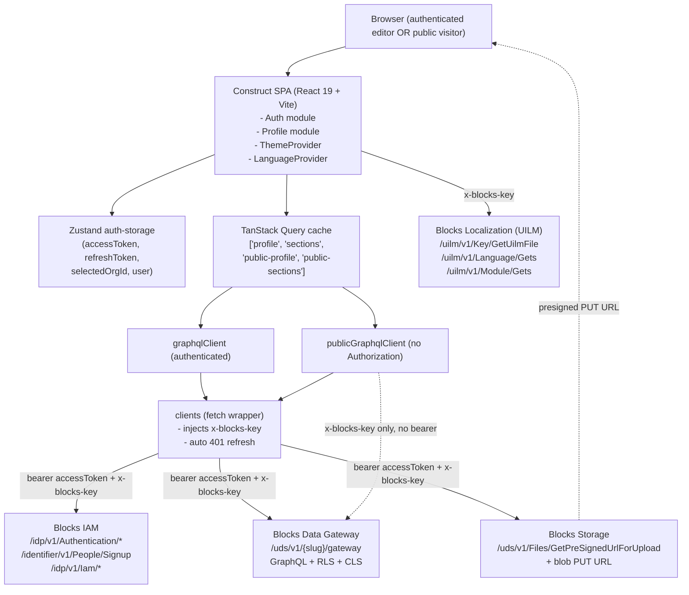
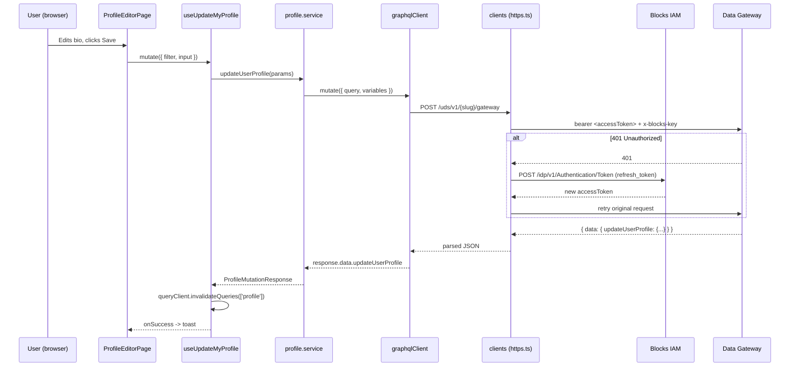
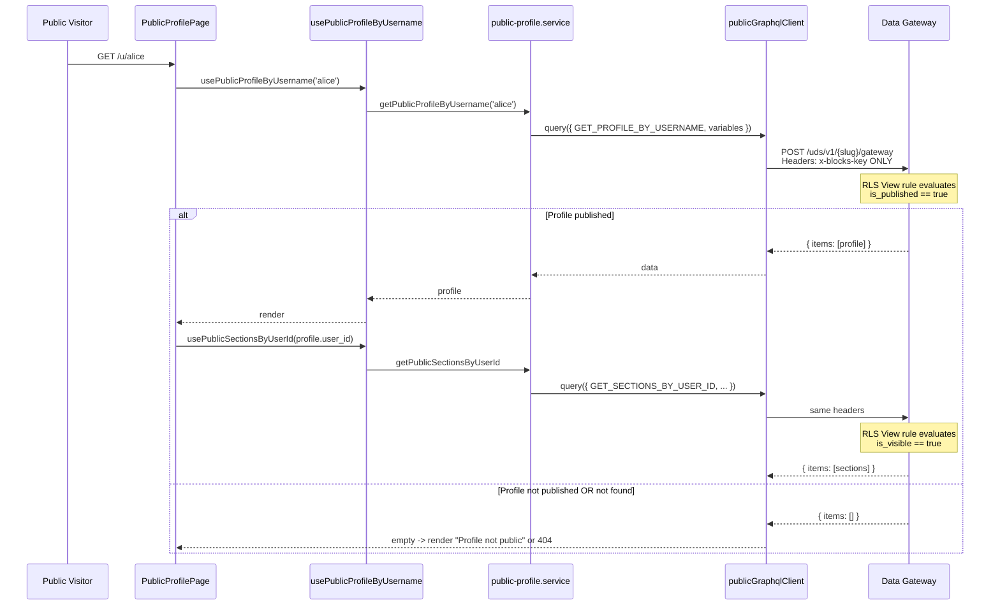
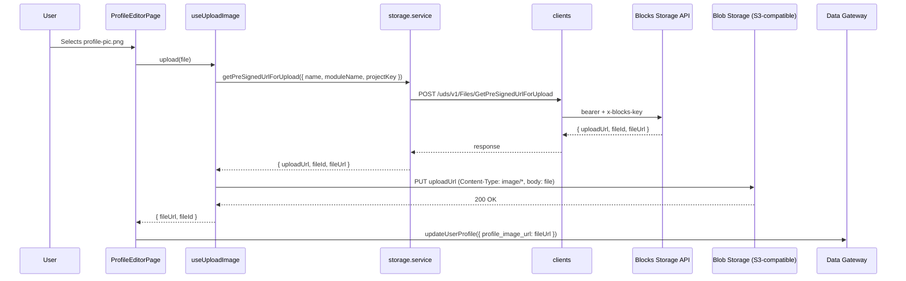
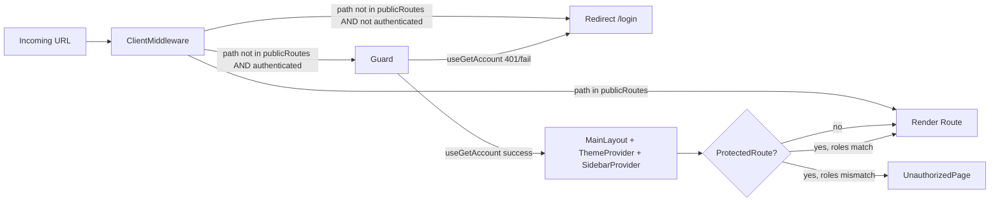

# Design Document: Universal Profile Engine

## Overview

Universal Profile Engine is a multi-tenant website-builder SaaS where any signed-up user can edit and publish a personal profile (display name, headline, bio, images, social links, custom sections, theme) and share it via a public URL at `/u/:username`. A single deployment serves many independent tenants; data isolation is enforced by SELISE Blocks Row-Level Security (RLS) rules on the `user_profile` and `user_custom_section` schemas, not by frontend logic.

The application is a React 19 + TypeScript SPA built on top of the SELISE Blocks **Construct** blueprint. It has **no custom backend**: authentication goes through Blocks IAM, data persistence goes through the Blocks Data Gateway over GraphQL, file uploads go through Blocks Storage using presigned URLs, and all UI strings are fetched at runtime from the Blocks Localization (UILM) service. Deployment is git-driven: the `main` branch maps to production and `dev` maps to development on Blocks Cloud.

The scaffold already exists at `d:\Project 3 Selise Block\universal-profile-engine` with a complete Construct baseline (auth, i18next, theme provider, route guards, TanStack Query wrappers, Zustand auth store, Radix UI kit) plus a partially-implemented `profile` module (`src/modules/profile/**`) containing GraphQL queries/mutations, a typed service layer, TanStack Query hooks for both authenticated and public access, a Zod-typed domain model, and route wiring in `src/routes/app-routes.tsx`. This design document describes the final target state and the contract each layer must uphold, including what is already in place and what still needs to be added.

## Architecture

### High-Level Component Diagram



### Request Flow: Authenticated Editor Saving a Profile



### Request Flow: Public Visitor Viewing a Profile



### Request Flow: Image Upload (Presigned URL, Three Steps)



### Tenancy & Data-Isolation Model

- Every authenticated request carries `Authorization: bearer <accessToken>`. The access token is a JWT whose `user_id` / `email` / `org_id` / `roles` claims are consumed by the Data Gateway when evaluating RLS rules.
- The Data Gateway RLS rules configured in PORTAL_SETUP_GUIDE.md section 3.4 enforce that:
  - Only the owner (`user_id == auth.userId`) can create/edit `user_profile` rows.
  - Only `admin` role can delete `user_profile` rows.
  - `user_custom_section` rows can be created/edited/deleted only by their owner.
  - View is `Public` for both schemas, but Blocks RLS layers an implicit filter (`is_published == true` for `user_profile`, `is_visible == true` for `user_custom_section`) that the publicGraphqlClient relies on.
- The frontend never trusts itself to enforce isolation. It issues the query; the gateway refuses or filters based on the calling principal. Frontend tests in section "Testing Strategy" verify this boundary.

## Components and Interfaces

### Module Map

```
src/
├── App.tsx                              (providers: BrowserRouter, QueryClient, LanguageProvider)
├── index.tsx                            (initializeProjectKey, renderRoot)
├── routes/
│   ├── app-routes.tsx                   (✅ exists; wires public + dashboard routes)
│   └── auth.route.tsx                   (✅ exists; AuthRoutes under <AuthLayout>)
├── layout/
│   ├── main-layout/                     (✅ exists; sidebar + topbar for dashboard)
│   └── auth-layout/                     (✅ exists; centered auth card)
├── lib/
│   ├── https.ts                         (✅ exists; 401-refresh fetch wrapper)
│   ├── graphql-client.ts                (✅ exists; authenticated client)
│   ├── public-graphql-client.ts         (✅ exists; unauthenticated client)
│   └── api/services/storage.service.ts  (✅ exists; getPreSignedUrlForUpload)
├── modules/
│   ├── auth/                            (✅ existing Construct module, reused)
│   └── profile/                         (partially implemented - see below)
│       ├── graphql/
│       │   ├── queries.ts               (✅ exists; 4 queries)
│       │   └── mutations.ts             (✅ exists; 7 mutations + reorder stub)
│       ├── services/
│       │   ├── profile.service.ts       (✅ exists; authenticated CRUD)
│       │   └── public-profile.service.ts(✅ exists; public read-only)
│       ├── hooks/
│       │   ├── use-profile.ts           (✅ exists; authenticated hooks)
│       │   ├── use-public-profile.ts    (✅ exists; public hooks)
│       │   └── use-upload-image.ts      (🟡 new; wraps getPreSignedUrlForUpload)
│       ├── pages/
│       │   ├── landing/                 (✅ exists; marketing home at /)
│       │   ├── profile-editor/          (✅ exists; /dashboard/profile)
│       │   ├── appearance/              (✅ exists; /dashboard/appearance)
│       │   ├── sections/                (✅ exists; /dashboard/sections)
│       │   ├── preview/                 (✅ exists; /dashboard/preview)
│       │   ├── public-profile/          (✅ exists; /u/:username)
│       │   ├── browse/                  (✅ exists; /browse)
│       │   └── admin/                   (✅ exists; /dashboard/admin)
│       ├── types/profile.types.ts       (✅ exists; UserProfile, UserCustomSection, params)
│       └── index.ts                     (✅ exists; barrel export)
├── state/
│   ├── client-middleware.tsx            (✅ exists; public-route allowlist)
│   ├── store/auth/
│   │   ├── index.tsx                    (✅ exists; Zustand auth-storage)
│   │   ├── guard.tsx                    (✅ exists; fetches user account)
│   │   └── protected-route.tsx          (✅ exists; role/permission gate)
│   └── query-client/hooks.tsx           (✅ exists; useGlobalQuery/Mutation)
├── styles/theme/theme-provider.tsx      (✅ exists; applies CSS variables)
└── i18n/
    ├── i18n.ts                          (✅ exists; initReactI18next)
    ├── language-context.tsx             (✅ exists; loads modules per route)
    └── route-module-map.ts              (🟡 needs entries for /dashboard/*, /u/:username)
```

**Legend**: ✅ implemented, 🟡 partially implemented or planned, ❌ not yet started.

### Component Interfaces

#### `ClientMiddleware` (route gate)

**Purpose**: Redirect unauthenticated users away from protected routes.

**Interface**:
```typescript
interface ClientMiddlewareProps {
  children: React.ReactNode;
}

const publicRoutes: readonly string[] = [
  '/', '/browse',
  '/login', '/signup', '/forgot-password', '/resetpassword',
  '/activate', '/success', '/activate-failed', '/sent-email',
  '/verify-mfa', '/oidc', '/sso/:provider/callback',
  '/u/:username', '/404', '/503',
];
```

**Responsibilities**:
- On mount, read `isAuthenticated` from `useAuthStore`.
- If unauthenticated and `location.pathname` does not match any entry in `publicRoutes` (allowing for `/u/*` and `/sso/*/callback` wildcards), `navigate('/login')`.
- Otherwise render `children`.

#### `Guard` (account loader)

**Purpose**: After authentication, fetch the account profile and populate `useAuthStore.user` before rendering any dashboard route.

**Interface**:
```typescript
interface GuardProps {
  children: React.ReactNode;
}
```

**Responsibilities**:
- Call `useGetAccount()` once on mount.
- Show `<LoadingOverlay />` while pending.
- On success, `setUser(data)`; on error (e.g., 401 after refresh fails), trigger `logout()` and redirect to `/login`.

#### `ProtectedRoute` (role/permission gate)

**Interface**:
```typescript
interface ProtectedRouteProps {
  children: React.ReactNode;
  roles?: string[];
  permissions?: string[];
  opt?: 'all' | 'any';
}
```

**Responsibilities**:
- Use `useIsProtected({ roles, permissions, opt })` to evaluate against `user.memberships` for the current `org_id`.
- If unauthenticated → throw `'Unauthenticated'` (caught by error boundary).
- If authenticated but lacking roles/permissions → render `<UnauthorizedPage />`.
- Otherwise render `children`.

#### `PublicOnlyRoute` (reverse guard)

**Purpose**: Redirect already-authenticated users away from `/login`, `/signup`, etc.

**Interface**:
```typescript
interface PublicOnlyRouteProps {
  children: React.ReactNode;
  redirectTo?: string; // defaults to '/dashboard'
}
```

#### `ThemeProvider` (profile-aware theming)

**Interface**:
```typescript
interface ThemeProviderProps {
  children: React.ReactNode;
  overrides?: {
    theme_preference?: 'minimal' | 'bold' | 'dark' | 'gradient';
    accent_color?: string;  // hex
    font_family?: 'sans' | 'serif' | 'mono';
  };
}
```

**Responsibilities**:
- For dashboard routes: read `light`/`dark`/`system` from localStorage key `ui-theme`.
- For `/u/:username`: accept `overrides` from the fetched `UserProfile`. Set CSS variables `--accent`, `--font-family`, and toggle `.theme-minimal` / `.theme-bold` / `.theme-dark` / `.theme-gradient` classes on `<html>` for the lifetime of that page.
- On unmount, restore default theme.

#### `useUploadImage` (new hook)

**Purpose**: Encapsulate the three-step presigned-URL upload. Returns a stable `upload(file)` callback plus progress state.

```typescript
interface UseUploadImageOptions {
  moduleName: 'profile_image' | 'header_image' | 'section_media';
  maxBytes?: number;          // default 5 MB for profile, 10 MB for header
  acceptedMimeTypes?: string[]; // default ['image/jpeg', 'image/png', 'image/webp', 'image/gif']
}

interface UseUploadImageResult {
  upload: (file: File) => Promise<{ fileId: string; fileUrl: string }>;
  isUploading: boolean;
  progress: number;   // 0..100
  error: Error | null;
  reset: () => void;
}

function useUploadImage(opts: UseUploadImageOptions): UseUploadImageResult;
```

## Data Models

### Schema: `user_profile`

| Field | Type | Required | Unique / Indexed | Default | CLS Rule |
|-------|------|----------|------------------|---------|----------|
| `ItemId` | String (UUID) | auto | Indexed (PK) | server | — |
| `user_id` | String | Yes | Indexed | — | read-only after creation |
| `username` | String | Yes | Unique, Indexed | — | editable by owner |
| `display_name` | String | Yes | — | — | editable by owner |
| `headline` | String | No | — | `''` | editable by owner |
| `bio_text` | String | No | — | `''` | editable by owner |
| `profile_image_url` | String | No | — | `''` | editable by owner |
| `header_image_url` | String | No | — | `''` | editable by owner |
| `social_links` | `Array<{ platform, url, label }>` | No | — | `[]` | editable by owner |
| `theme_preference` | String | No | — | `'minimal'` | editable by owner |
| `accent_color` | String (hex) | No | — | `'#3b82f6'` | editable by owner |
| `font_family` | String | No | — | `'sans'` | editable by owner |
| `view_count` | Number | No | — | `0` | incremented server-side (currently owner-editable) |
| `is_published` | Boolean | No | — | `false` | editable by owner only |
| `created_at` | DateTime | auto | — | `now()` | read-only |
| `updated_at` | DateTime | auto | — | `now()` | read-only |
| `CreatedBy` / `LastUpdatedBy` | String | auto | — | auth user | read-only |

**Validation rules (enforced client-side via Zod):**
- `username`: `/^[a-z0-9][a-z0-9-_]{2,29}$/` (3–30 chars, lowercase, starts alphanumeric).
- `display_name`: 1–60 chars, trimmed.
- `headline`: 0–120 chars.
- `bio_text`: 0–2000 chars.
- `profile_image_url` / `header_image_url`: must be HTTPS or empty.
- `social_links[].platform`: enum `'linkedin' | 'github' | 'portfolio' | 'twitter' | 'youtube' | 'email' | 'other'`.
- `social_links[].url`: valid URL or `mailto:` for `'email'`.
- `accent_color`: `/^#[0-9a-fA-F]{6}$/`.
- `theme_preference`: enum `'minimal' | 'bold' | 'dark' | 'gradient'`.
- `font_family`: enum `'sans' | 'serif' | 'mono'`.

**RLS rules (portal config, not frontend):**
- `View`: Public, gated by implicit `is_published == true` filter.
- `Create`: Custom — `user_id == auth.userId`.
- `Edit`: Custom — `user_id == auth.userId`.
- `Delete`: Role-based — `admin` only.

### Schema: `user_custom_section`

| Field | Type | Required | Default | CLS Rule |
|-------|------|----------|---------|----------|
| `ItemId` | String (UUID) | auto | server | — |
| `user_id` | String | Yes | — | read-only after creation |
| `section_type` | String | Yes | — | editable by owner |
| `section_title` | String | No | `''` | editable by owner |
| `section_content` | String | No | `''` | editable by owner |
| `section_order` | Number | No | `0` | editable by owner |
| `is_visible` | Boolean | No | `true` | editable by owner |
| `created_at` / `updated_at` | DateTime | auto | `now()` | read-only |

**Validation rules:**
- `section_type` ∈ `'Experience' | 'Project' | 'Skill' | 'Education' | 'Custom'`.
- `section_title`: 0–80 chars.
- `section_content`: 0–5000 chars, Markdown allowed.
- `section_order`: integer ≥ 0.

**RLS rules:**
- `View`: Public, gated by implicit `is_visible == true` filter.
- `Create`/`Edit`/`Delete`: Custom — `user_id == auth.userId`.

### GraphQL Input / Output Types

These mirror the TypeScript types in `src/modules/profile/types/profile.types.ts` (already defined).

```graphql
type UserProfile {
  ItemId: String!
  user_id: String!
  username: String!
  display_name: String!
  headline: String
  bio_text: String
  profile_image_url: String
  header_image_url: String
  social_links: [SocialLink!]
  theme_preference: String
  accent_color: String
  font_family: String
  view_count: Int
  is_published: Boolean!
  created_at: DateTime
  updated_at: DateTime
  CreatedBy: String
  CreatedDate: DateTime
  LastUpdatedBy: String
  LastUpdatedDate: DateTime
}

type SocialLink { platform: String! url: String! label: String! }

input UserProfileInsertInput {
  user_id: String!
  username: String!
  display_name: String!
  headline: String
  bio_text: String
  profile_image_url: String
  header_image_url: String
  social_links: [SocialLinkInput!]
  theme_preference: String
  accent_color: String
  font_family: String
  is_published: Boolean
}

input UserProfileUpdateInput {
  display_name: String
  headline: String
  bio_text: String
  profile_image_url: String
  header_image_url: String
  social_links: [SocialLinkInput!]
  theme_preference: String
  accent_color: String
  font_family: String
  view_count: Int
  is_published: Boolean
  username: String
}

type MutationResponse {
  itemId: String!
  totalImpactedData: Int!
  acknowledged: Boolean!
}

input DynamicQueryInput {
  filter: String     # JSON string, e.g. "{\"username\":\"alice\"}"
  sort: String       # JSON string, e.g. "{\"section_order\":\"asc\"}"
  pageNo: Int
  pageSize: Int
}
```

The same pattern repeats for `UserCustomSection{,InsertInput,UpdateInput,DeleteInput}`.

## API Integration Patterns

### IAM (Authentication)

All calls target `VITE_API_BASE_URL` and go through `clients` in `src/lib/https.ts` so that 401 refresh interception works uniformly.

| Action | Endpoint | Method | Body |
|--------|----------|--------|------|
| Sign in (password) | `/idp/v1/Authentication/Token` | POST | `URLSearchParams({ grant_type: 'password', username, password })` |
| Refresh | `/idp/v1/Authentication/Token` | POST | `URLSearchParams({ grant_type: 'refresh_token', refresh_token })` |
| Sign out | `/idp/v1/Authentication/Logout` | POST | JSON `{ refreshToken }` |
| Sign up | `/identifier/v1/People/Signup` | POST | JSON `{ email, password, firstName, lastName, ... }` |
| Forgot password | `/idp/v1/Iam/Recover` | POST | JSON `{ email }` |
| Reset password | `/idp/v1/Iam/ResetPassword` | POST | JSON `{ token, newPassword }` |
| Activate | `/idp/v1/Iam/Activate` | POST | JSON `{ activationCode, password }` |
| Validate activation code | `/idp/v1/Iam/ValidateActivationCode` | POST | JSON `{ activationCode }` |

**Response shape (sign-in / refresh):**
```typescript
interface TokenResponse {
  access_token: string;
  refresh_token: string;
  expires_in: number;    // seconds
  token_type: 'Bearer';
  scope?: string;
}
```

**401 refresh flow** (implemented in `src/lib/https.ts`):
1. Caller issues request with `bearer <accessToken>` (or cookies on deployed origin).
2. If response is 401 AND the error body does NOT contain `error_description` (which would indicate a login-form failure, not an expired token), `getRefreshToken()` is invoked.
3. On success, `useAuthStore.setState({ accessToken: newToken })` and the original request is retried **once**.
4. On refresh failure (`invalid_refresh_token`, 401, or network error), the global wrappers in `src/state/query-client/hooks.tsx` show the session-expired overlay, call `logout()`, navigate to `/login`, and surface a destructive toast. The original query or mutation settles in its error branch.

### Data Gateway — authenticated `graphqlClient`

- Endpoint: `` `${cleanBaseUrl}/uds/v1/${VITE_PROJECT_SLUG}/gateway` ``
- Headers on every request:
  - `Content-Type: application/json`
  - `x-blocks-key: <VITE_X_BLOCKS_KEY>`
  - `Authorization: Bearer <accessToken>` on localhost; cookies (`credentials: 'include'`) on deployed origin.
- Token source: `useAuthStore.getState().accessToken`.
- Throws `Error(firstGraphqlError.message)` when `response.errors.length > 0`.

Interface (already implemented):
```typescript
interface GraphQLClient {
  query<T>(req: { query: string; variables?: Record<string, any> }): Promise<T>;
  mutate<T>(req: { query: string; variables?: Record<string, any> }): Promise<T>;
}
```

### Data Gateway — `publicGraphqlClient`

- Same endpoint as above.
- Headers: `Content-Type`, `x-blocks-key` **only**. No `Authorization`, no cookies, `credentials` omitted.
- Used only by `public-profile.service.ts` for `/u/:username`, `/browse`.
- Relies entirely on Data Gateway RLS for:
  - `user_profile.view` Public + `is_published == true`
  - `user_custom_section.view` Public + `is_visible == true`
- **Never** used for mutations. Correctness Property #7 asserts this.

### Storage (presigned upload)

```typescript
// src/lib/api/services/storage.service.ts (already implemented)
interface GetPreSignedUrlForUploadPayload {
  name: string;                          // original filename
  moduleName: string;                    // 'profile_image' | 'header_image' | 'section_media'
  projectKey: string;                    // VITE_X_BLOCKS_KEY
  itemId?: string;                       // target record ID (optional)
  parentDirectoryId?: string;
  tags?: string[];
  accessModifier?: 'Public' | 'Private';
  metaData?: Record<string, string>;
  configurationName?: string;
  additionalProperties?: Record<string, unknown>;
}

interface GetPreSignedUrlForUploadResponse {
  uploadUrl: string;    // short-lived PUT URL
  fileId: string;       // opaque Blocks file identifier
  fileUrl: string;      // long-lived GET URL to save into user_profile
  expiresAt: string;    // ISO datetime
}
```

Three-step flow (executed in `useUploadImage`):
1. `POST /uds/v1/Files/GetPreSignedUrlForUpload` → receive `{ uploadUrl, fileId, fileUrl }`.
2. `PUT uploadUrl` with `Content-Type: <file.type>` and the raw `File` body. No `x-blocks-key`, no `Authorization` (the URL itself is the capability).
3. Caller uses the returned `fileUrl` in a subsequent `updateUserProfile` mutation.

Presigned URLs are single-use and time-limited (expire within minutes). Re-using one returns 403 from the blob store; Correctness Property #6 covers this.

### Localization (UILM)

```typescript
GET /uilm/v1/Key/GetUilmFile?Language=<lang>&ModuleName=<module>&ProjectKey=<key>
GET /uilm/v1/Language/Gets?ProjectKey=<key>
GET /uilm/v1/Module/Gets?ProjectKey=<key>
```

- `LanguageProvider` calls `loadTranslations(language, moduleName)` for every entry in `routeModuleMap[currentRoute]`.
- `loadTranslations` populates i18next via `addResourceBundle` with namespace `'translation'` AND `moduleName`.
- While any load is pending, `useLanguageContext().isLoading` is `true` and `AppRoutes` renders `<LoadingOverlay />`.
- Browser extension "key mode" listens to `window.postMessage({ action: 'keymode', keymode }) ` and monkey-patches `i18n.t` to return raw keys, forcing a `languageChanged` emit.

**`route-module-map.ts` (planned updates)**:
```typescript
export const routeModuleMap: Record<string, string[]> = {
  '/': ['common', 'landing'],
  '/browse': ['common', 'browse'],
  '/login': ['common', 'auth'],
  '/signup': ['common', 'auth'],
  '/forgot-password': ['common', 'auth'],
  '/resetpassword': ['common', 'auth'],
  '/activate': ['common', 'auth'],
  '/verify-mfa': ['common', 'auth', 'mfa'],
  '/dashboard/profile': ['common', 'editor'],
  '/dashboard/appearance': ['common', 'editor', 'themes'],
  '/dashboard/sections': ['common', 'editor'],
  '/dashboard/preview': ['common', 'editor', 'viewer'],
  '/u/:username': ['common', 'viewer'],
  '/404': ['common'],
};
```

## State Management

### Zustand — `useAuthStore` (existing)

```typescript
interface AuthState {
  isAuthenticated: boolean;
  user: AccountSummary | null;
  accessToken: string | null;
  refreshToken: string | null;
  selectedOrgId: string | null;
  tokens: TokenResponse | null;

  login(accessToken: string, refreshToken: string): void;
  setAccessToken(accessToken: string): void;
  setUser(user: AccountSummary): void;
  logout(): void;
  reset(): void;
}
```

Persistence: `persist` middleware with key `'auth-storage'` in `localStorage`. `login` and `setAccessToken` decode the JWT with `jwt-decode` to extract `org_id` into `selectedOrgId`. `logout` removes `'auth-storage'` from localStorage and sets state to `initialState`.

### Zustand — `useProfileEditorStore` (new, ephemeral)

Holds UI state that should not round-trip through TanStack Query (dirty flag, unsaved section draft, drag preview). Not persisted.

```typescript
interface ProfileEditorState {
  isDirty: boolean;
  draftSection: Partial<UserCustomSection> | null;
  dragPreviewOrder: string[] | null;   // ItemIds in drag preview order

  markDirty(): void;
  clearDirty(): void;
  setDraftSection(draft: Partial<UserCustomSection> | null): void;
  setDragPreview(ids: string[] | null): void;
  reset(): void;
}
```

### TanStack Query — keys and invalidation strategy

| Key | Queried by | Invalidated by |
|-----|------------|----------------|
| `['profile', { username }]` | `useGetProfileByUsername` | `useUpdateProfile`, `usePublishProfile`, `useUnpublishProfile`, `useCreateProfile` |
| `['profile', { userId }]` | `useGetProfileByUserId` (incl. `useGetMyProfile`) | same as above |
| `['profiles', { pageNo, pageSize }]` | `useGetAllPublishedProfiles` | `usePublishProfile`, `useUnpublishProfile` |
| `['sections', { userId }]` | `useGetSectionsByUserId` (incl. `useGetMySections`) | `useCreateSection`, `useUpdateSection`, `useDeleteSection`, `useReorderSections` |
| `['public-profile', { username }]` | `usePublicProfileByUsername` | (not invalidated from editor; editor uses authenticated keys) |
| `['public-sections', { userId }]` | `usePublicSectionsByUserId` | (same) |
| `['public-profiles', { pageNo, pageSize }]` | `usePublicPublishedProfiles` | (same) |

**Invalidation pattern** (used in existing mutations):
```typescript
queryClient.invalidateQueries({
  predicate: (q) => q.queryKey[0] === 'profile' || q.queryKey[0] === 'profiles',
});
```

**Stale / GC defaults** (reused from inventory pattern):
- `staleTime: 5 * 60 * 1000` (5 min)
- `gcTime: 10 * 60 * 1000` (10 min)
- `refetchOnWindowFocus: false`

**Public hooks use `useQuery` directly** (not `useGlobalQuery`), so a 401 on a public request does not trigger the session-expired overlay. `retry: false` prevents repeat attempts when a profile is private.

## Key GraphQL Operations

These strings already exist in `src/modules/profile/graphql/queries.ts` and `mutations.ts`. Listed here as the authoritative design contract.

### Queries

#### `GET_PROFILE_BY_USERNAME_QUERY`
```graphql
query GetUserProfiles($input: DynamicQueryInput) {
  getUserProfiles(input: $input) {
    hasNextPage hasPreviousPage totalCount totalPages pageSize pageNo
    items {
      ItemId user_id username display_name headline bio_text
      profile_image_url header_image_url social_links
      theme_preference is_published created_at updated_at
      CreatedBy CreatedDate LastUpdatedBy LastUpdatedDate
    }
  }
}
```
Variables: `{ input: { filter: '{"username":"<value>"}', sort: '{}', pageNo: 1, pageSize: 1 } }`.

#### `GET_PROFILE_BY_USER_ID_QUERY`
Same shape; variables use `filter: '{"user_id":"<value>"}'`.

#### `GET_ALL_PUBLISHED_PROFILES_QUERY`
Projection limited to listing fields (`ItemId`, `user_id`, `username`, `display_name`, `headline`, `profile_image_url`, `is_published`). Variables: `{ input: { filter: '{"is_published":true}', sort: '{}', pageNo, pageSize } }`.

#### `GET_SECTIONS_BY_USER_ID_QUERY`
```graphql
query GetUserCustomSections($input: DynamicQueryInput) {
  getUserCustomSections(input: $input) {
    hasNextPage hasPreviousPage totalCount totalPages pageSize pageNo
    items {
      ItemId user_id section_type section_title section_content
      section_order is_visible created_at updated_at
      CreatedBy CreatedDate LastUpdatedBy LastUpdatedDate
    }
  }
}
```
Variables: `{ input: { filter: '{"user_id":"<value>"}', sort: '{"section_order":"asc"}', pageNo: 1, pageSize: 100 } }`.

### Mutations

#### `CREATE_USER_PROFILE_MUTATION`
```graphql
mutation InsertUserProfile($input: UserProfileInsertInput!) {
  insertUserProfile(input: $input) { itemId totalImpactedData acknowledged }
}
```

#### `UPDATE_USER_PROFILE_MUTATION`
```graphql
mutation UpdateUserProfile($filter: String!, $input: UserProfileUpdateInput!) {
  updateUserProfile(filter: $filter, input: $input) {
    itemId totalImpactedData acknowledged
  }
}
```

#### `PUBLISH_USER_PROFILE_MUTATION` / `UNPUBLISH_USER_PROFILE_MUTATION`
Same gateway operation (`updateUserProfile`) with `input: { is_published: true | false }`. Exposed as distinct string constants for readability, observability, and targeted toasts.

#### `CREATE_CUSTOM_SECTION_MUTATION`
```graphql
mutation InsertUserCustomSection($input: UserCustomSectionInsertInput!) {
  insertUserCustomSection(input: $input) { itemId totalImpactedData acknowledged }
}
```

#### `UPDATE_CUSTOM_SECTION_MUTATION`
```graphql
mutation UpdateUserCustomSection($filter: String!, $input: UserCustomSectionUpdateInput!) {
  updateUserCustomSection(filter: $filter, input: $input) {
    itemId totalImpactedData acknowledged
  }
}
```

#### `DELETE_CUSTOM_SECTION_MUTATION`
```graphql
mutation DeleteUserCustomSection($filter: String!, $input: UserCustomSectionDeleteInput!) {
  deleteUserCustomSection(filter: $filter, input: $input) {
    itemId totalImpactedData acknowledged
  }
}
```
Variables: `{ filter: '{"ItemId":"<id>"}', input: { isHardDelete: true } }`.

#### Reorder (composite)
Blocks Data Gateway does not expose a native bulk-update mutation. `useReorderSections(ids)` iterates the array and issues `UPDATE_CUSTOM_SECTION_MUTATION` for each section whose `section_order` must change, in parallel via `Promise.all`. A reserved `REORDER_CUSTOM_SECTIONS_MUTATION` string is kept as a stub for future gateway support.

## Hook Signatures (Low-Level Design)

All hooks live under `src/modules/profile/hooks/` and return TanStack Query-compatible result objects. Authenticated hooks wrap `useGlobalQuery` / `useGlobalMutation` (auto session-expired handling); public hooks wrap vanilla `useQuery`.

```typescript
// -------- PUBLIC (unauthenticated) --------

function usePublicProfileByUsername(
  username: string
): UseQueryResult<{ getUserProfiles: { items: UserProfile[] } }, Error>;

function usePublicSectionsByUserId(
  userId: string
): UseQueryResult<{ getUserCustomSections: { items: UserCustomSection[] } }, Error>;

function usePublicPublishedProfiles(
  pageNo?: number,
  pageSize?: number
): UseQueryResult<{ getUserProfiles: { items: UserProfile[] } }, Error>;


// -------- AUTHENTICATED READS --------

function useGetProfileByUsername(
  username: string
): UseQueryResult<{ getUserProfiles: { items: UserProfile[] } }, Error>;

function useGetProfileByUserId(
  userId: string
): UseQueryResult<{ getUserProfiles: { items: UserProfile[] } }, Error>;

// Convenience wrapper: reads user_id from useAuthStore.user.itemId
function useGetMyProfile(): UseQueryResult<
  { getUserProfiles: { items: UserProfile[] } },
  Error
>;

function useGetMySections(): UseQueryResult<
  { getUserCustomSections: { items: UserCustomSection[] } },
  Error
>;

function useGetSectionsByUserId(
  userId: string
): UseQueryResult<{ getUserCustomSections: { items: UserCustomSection[] } }, Error>;

function useGetAllPublishedProfiles(
  pageNo?: number,
  pageSize?: number
): UseQueryResult<{ getUserProfiles: { items: UserProfile[] } }, Error>;


// -------- AUTHENTICATED WRITES --------

function useCreateProfile(): UseMutationResult<
  ProfileMutationResponse, Error, CreateProfileParams
>;

function useUpdateMyProfile(): UseMutationResult<
  ProfileMutationResponse, Error, UpdateProfileParams
>;
// alias retained for compatibility with existing use-profile.ts:
// export { useUpdateMyProfile as useUpdateProfile };

function usePublishProfile(): UseMutationResult<
  ProfileMutationResponse, Error, string /* filter */
>;

function useUnpublishProfile(): UseMutationResult<
  ProfileMutationResponse, Error, string /* filter */
>;

function useCreateSection(): UseMutationResult<
  ProfileMutationResponse, Error, CreateSectionParams
>;

function useUpdateSection(): UseMutationResult<
  ProfileMutationResponse, Error, UpdateSectionParams
>;

function useDeleteSection(): UseMutationResult<
  ProfileMutationResponse, Error, DeleteSectionParams
>;

function useReorderSections(
): UseMutationResult<ProfileMutationResponse[], Error, string[] /* ordered ItemIds */>;


// -------- UPLOAD --------

function useUploadImage(
  opts: UseUploadImageOptions
): UseUploadImageResult;
```

### Algorithmic Pseudocode — Core Operations

#### `useUploadImage.upload`

```pascal
ALGORITHM uploadImage(file, moduleName)
INPUT : file of type File, moduleName of type string
OUTPUT: { fileId, fileUrl } of type UploadResult

BEGIN
  ASSERT file IS NOT NULL
  ASSERT file.size <= opts.maxBytes
  ASSERT file.type IN opts.acceptedMimeTypes

  setIsUploading(TRUE)
  setProgress(0)

  TRY
    // Step 1: request presigned URL
    presigned <- storage.getPreSignedUrlForUpload({
      name: file.name,
      moduleName: moduleName,
      projectKey: import.meta.env.VITE_X_BLOCKS_KEY,
      accessModifier: 'Public'
    })

    ASSERT presigned.uploadUrl IS NOT NULL
    ASSERT presigned.fileUrl IS NOT NULL

    setProgress(25)

    // Step 2: PUT blob
    response <- fetch(presigned.uploadUrl, {
      method: 'PUT',
      headers: { 'Content-Type': file.type },
      body: file
    })

    IF response.status NOT IN {200, 201, 204} THEN
      THROW UploadFailedError('blob PUT failed: ' + response.status)
    END IF

    setProgress(100)

    // Step 3: return URL for caller to persist via updateUserProfile
    RETURN { fileId: presigned.fileId, fileUrl: presigned.fileUrl }

  CATCH error
    setError(error)
    toast.destructive('upload_failed')
    THROW error

  FINALLY
    setIsUploading(FALSE)
  END TRY
END
```

**Preconditions**: user is authenticated, `file` is a valid `File` of allowed type and size, network is reachable.

**Postconditions**: on success, caller receives a permanent `fileUrl` pointing to the uploaded object; on failure, no change to `user_profile` record, error is surfaced via toast, hook state reflects `error`.

**Loop invariants**: none (straight-line flow).

#### `useReorderSections`

```pascal
ALGORITHM reorderSections(orderedIds)
INPUT : orderedIds of type Array<String>   // target order of ItemIds
OUTPUT: results of type Array<ProfileMutationResponse>

BEGIN
  ASSERT orderedIds.length > 0
  ASSERT all ids in orderedIds are distinct

  currentSections <- queryClient.getQueryData(['sections', { userId: me.itemId }])
  ASSERT currentSections IS NOT NULL

  // Build the minimal set of UPDATE operations required.
  updates <- []
  FOR i FROM 0 TO orderedIds.length - 1 DO
    // Loop invariant: updates[0..i-1] contain only sections whose new
    // section_order differs from their persisted section_order.
    section <- find(currentSections, ItemId = orderedIds[i])
    ASSERT section IS NOT NULL

    IF section.section_order != i THEN
      updates.push({
        filter: '{"ItemId":"' + section.ItemId + '"}',
        input:  { section_order: i }
      })
    END IF
  END FOR

  // Execute all updates in parallel; surface first failure.
  results <- AWAIT Promise.all(updates.map(u -> updateCustomSection(u)))

  queryClient.invalidateQueries({ queryKey: ['sections'] })
  RETURN results
END
```

**Preconditions**: caller owns every section in `orderedIds`; the cache contains the authoritative set of that user's sections.

**Postconditions**: after success, refetching `['sections', { userId }]` yields sections in the exact order of `orderedIds`; server-side `section_order` values form a contiguous range `0..N-1`.

**Loop invariants**: at iteration `i`, `updates` contains at most `i` pending writes, each corresponding to a section whose persisted order mismatched its target index.

#### Public Profile Render

```pascal
ALGORITHM renderPublicProfile(username)
INPUT : username of type string
OUTPUT: React element

BEGIN
  profileResp <- usePublicProfileByUsername(username)

  IF profileResp.isLoading THEN
    RETURN <ProfileSkeleton />
  END IF

  IF profileResp.isError OR profileResp.data.items.length = 0 THEN
    // RLS filtered out unpublished/nonexistent rows.
    RETURN <NotFoundPage />
  END IF

  profile <- profileResp.data.items[0]

  ASSERT profile.is_published = TRUE   // RLS guarantees this; defense-in-depth

  sectionsResp <- usePublicSectionsByUserId(profile.user_id)
  sections <- sectionsResp.data?.items ?? []

  // RLS guarantees all returned sections are visible; defense-in-depth filter
  // protects against accidental regressions in public client.
  visibleSections <- filter(sections, s -> s.is_visible = TRUE)
  orderedSections <- sort(visibleSections, by s -> s.section_order ASC)

  RETURN (
    <ThemeProvider overrides={{
      theme_preference: profile.theme_preference,
      accent_color: profile.accent_color,
      font_family: profile.font_family
    }}>
      <SeoHead
        title={profile.display_name}
        description={profile.headline}
        ogImage={profile.profile_image_url}
      />
      <HeaderBanner url={profile.header_image_url} />
      <ProfileHero
        avatar={profile.profile_image_url}
        name={profile.display_name}
        headline={profile.headline}
      />
      <AboutSection bio={profile.bio_text} />
      <SocialLinksList links={profile.social_links ?? []} />
      {orderedSections.map(s -> <CustomSection key={s.ItemId} section={s} />)}
    </ThemeProvider>
  )
END
```

**Preconditions**: `username` is defined, `publicGraphqlClient` is reachable.

**Postconditions**: the rendered tree contains exactly the profile owner's published data and nothing else; no authentication UI is ever shown on this route.

## Example Usage

```tsx
// src/modules/profile/pages/profile-editor/profile-editor.tsx (shape)

import { useTranslation } from 'react-i18next';
import { useForm } from 'react-hook-form';
import { zodResolver } from '@hookform/resolvers/zod';
import { useGetMyProfile, useUpdateMyProfile } from '../../hooks/use-profile';
import { useUploadImage } from '../../hooks/use-upload-image';
import { profileFormSchema, ProfileFormValues } from '../../types/profile.types';

export function ProfileEditorPage() {
  const { t } = useTranslation();
  const { data, isLoading } = useGetMyProfile();
  const profile = data?.getUserProfiles.items[0];

  const updateProfile = useUpdateMyProfile();
  const profileImage = useUploadImage({ moduleName: 'profile_image', maxBytes: 5 * 1024 * 1024 });
  const headerImage = useUploadImage({ moduleName: 'header_image', maxBytes: 10 * 1024 * 1024 });

  const form = useForm<ProfileFormValues>({
    resolver: zodResolver(profileFormSchema),
    defaultValues: profile,
  });

  async function handleProfilePick(file: File) {
    const { fileUrl } = await profileImage.upload(file);
    await updateProfile.mutateAsync({
      filter: JSON.stringify({ ItemId: profile!.ItemId }),
      input: { profile_image_url: fileUrl },
    });
  }

  async function onSubmit(values: ProfileFormValues) {
    await updateProfile.mutateAsync({
      filter: JSON.stringify({ ItemId: profile!.ItemId }),
      input: values,
    });
  }

  if (isLoading) return <Skeleton />;
  return (/* form JSX using @/components/ui-kit/form */ null as any);
}
```

```tsx
// src/modules/profile/pages/public-profile/public-profile.tsx (shape)

import { useParams } from 'react-router-dom';
import {
  usePublicProfileByUsername,
  usePublicSectionsByUserId,
} from '../../hooks/use-public-profile';

export function PublicProfilePage() {
  const { username } = useParams<{ username: string }>();
  const profileQ = usePublicProfileByUsername(username!);
  const profile = profileQ.data?.getUserProfiles.items[0];
  const sectionsQ = usePublicSectionsByUserId(profile?.user_id ?? '');

  if (profileQ.isLoading) return <ProfileSkeleton />;
  if (!profile) return <NotFoundPage />;

  return (/* ThemeProvider overrides + sections */ null as any);
}
```

## Theme System

The theme of `/u/:username` is data-driven from the fetched `UserProfile`. The dashboard theme (light/dark/system) is controlled locally by the viewer.

**CSS contract** (consumed from `src/styles/index.css`):
```css
:root {
  --accent: #3b82f6;
  --font-family: ui-sans-serif, system-ui, sans-serif;
}
:root.theme-minimal { --bg-hero: #fff; --text-primary: #0f172a; }
:root.theme-bold    { --bg-hero: var(--accent); --text-primary: #fff; }
:root.theme-dark    { --bg-hero: #0b0f17; --text-primary: #f8fafc; }
:root.theme-gradient { --bg-hero: linear-gradient(135deg, var(--accent), #8b5cf6); --text-primary: #fff; }
:root.font-sans  { --font-family: ui-sans-serif, system-ui, sans-serif; }
:root.font-serif { --font-family: ui-serif, Georgia, serif; }
:root.font-mono  { --font-family: ui-monospace, Menlo, monospace; }
```

**Apply algorithm** (inside `ThemeProvider` when `overrides` is present):
```pascal
ALGORITHM applyProfileTheme(overrides)
INPUT : overrides = { theme_preference, accent_color, font_family }

BEGIN
  html <- document.documentElement

  // Snapshot prior state so we can restore on unmount
  previousClasses <- list of theme-* and font-* classes currently on html
  previousAccent  <- html.style.getPropertyValue('--accent')

  // Apply theme
  html.classList.remove('theme-minimal','theme-bold','theme-dark','theme-gradient')
  html.classList.add('theme-' + (overrides.theme_preference OR 'minimal'))

  html.classList.remove('font-sans','font-serif','font-mono')
  html.classList.add('font-' + (overrides.font_family OR 'sans'))

  IF overrides.accent_color matches /^#[0-9a-fA-F]{6}$/ THEN
    html.style.setProperty('--accent', overrides.accent_color)
  END IF

  RETURN cleanup function that restores previousClasses and previousAccent
END
```

## Route Guard Design



- `PublicOnlyRoute` wraps `/login`, `/signup`, `/forgot-password` and the OIDC/SSO callbacks to redirect already-authenticated users to `/dashboard`.
- `/u/:username`, `/`, `/browse`, `/404`, `/503` are in the public allowlist and bypass `Guard` entirely. They can be opened in a brand-new incognito window.

## Upload Flow (Pseudocode)

```pascal
ALGORITHM uploadAndPersistImage(file, fieldName)
INPUT : file of type File, fieldName in { 'profile_image_url', 'header_image_url' }
OUTPUT: updated UserProfile

PRECONDITIONS:
  - currentUser is authenticated
  - user_profile row for currentUser exists (ItemId known)
  - file passes client-side size and MIME checks

BEGIN
  // Step 1: request presigned URL
  presigned <- POST /uds/v1/Files/GetPreSignedUrlForUpload
               body: { name: file.name,
                       moduleName: fieldName = 'profile_image_url' ? 'profile_image' : 'header_image',
                       projectKey: VITE_X_BLOCKS_KEY }

  // Step 2: upload blob (single-use URL)
  putResp <- PUT presigned.uploadUrl
             headers: { 'Content-Type': file.type }
             body: file

  IF putResp.status NOT IN {200,201,204} THEN
    toast.destructive('upload_failed')
    RETURN previous UserProfile unchanged
  END IF

  // Step 3: persist URL on user_profile
  mutationResp <- mutate UPDATE_USER_PROFILE_MUTATION
                  variables: {
                    filter: '{"ItemId":"' + profile.ItemId + '"}',
                    input:  { [fieldName]: presigned.fileUrl }
                  }

  ASSERT mutationResp.acknowledged = TRUE

  queryClient.invalidateQueries(['profile'])
  toast.success('profile_image_updated')

  RETURN refetched UserProfile
END

POSTCONDITIONS:
  - On success: user_profile[fieldName] = presigned.fileUrl; public visitors see it
    immediately (after public-profile cache TTL expires).
  - On failure at Step 2: no mutation issued, record unchanged.
  - On failure at Step 3: blob exists but is unreferenced (acceptable; cleanup
    is left to a future janitor workflow).
```

## Error Handling Strategy

### Error taxonomy

| Origin | Example | Handling |
|--------|---------|----------|
| 401 on GraphQL (expired token) | Gateway returns 401 | `clients` auto-calls `/idp/v1/Authentication/Token` refresh and retries once. User sees nothing. |
| 401 on refresh itself | `invalid_refresh_token` | `useGlobalQuery`/`Mutation` shows session-expired overlay, `logout()`, navigate `/login`, destructive toast. |
| 401 on public GraphQL | Should never happen; treated as terminal | `publicGraphqlClient` has no refresh. Bubbles to `useQuery` with `retry: false`; page renders `<NotFoundPage />`. |
| GraphQL `errors[]` non-empty | RLS denial, validation fail | `graphqlClient.query/mutate` throws `Error(errors[0].message)`. Mutation hook's `onError` calls `handleError(error, { variant: 'destructive' })` which shows a toast. |
| Network failure | Offline, CORS | `fetch` rejects; same handleError path; query stays in `isError`. |
| Upload 4xx / 5xx | Presigned URL expired, wrong MIME | `useUploadImage` catches, sets `error`, destructive toast, caller falls through without mutating `user_profile`. No "orphaned URL" is written. |
| 404 on `/u/:username` | No row matches, or row is unpublished | `publicGraphqlClient` returns `{ items: [] }`. `PublicProfilePage` renders `<NotFoundPage />` with link home. |
| Username collision on signup | `CREATE_USER_PROFILE_MUTATION` fails with duplicate-key error from Mongo index | Signup service inspects error code, forces user back to username field with `'username_taken'` message. |

### `handleError` contract (from `src/hooks/use-error-handler.ts`)

```typescript
function handleError(
  error: unknown,
  options?: { variant?: 'destructive' | 'success' | 'info'; title?: string }
): void;

// Extracts:
//  - error.response?.data?.error_description
//  - error.message
//  - error.errors[0].message (GraphQL)
// then calls toast() with localized title if known.
```

### Optimistic vs. conservative updates

- Section reorder is **optimistic**: `queryClient.setQueryData(['sections', ...], newOrder)` before the mutation fires; on error, `queryClient.setQueryData(..., previousOrder)` and destructive toast.
- Profile field edits are **conservative**: form stays disabled during mutation; success only after server acknowledges. This avoids showing a stale optimistic state if RLS denies.
- Publish/unpublish is **conservative** for the same reason.
- Uploads never commit optimistically — the URL is written to the schema only after the blob PUT returns 2xx.

## Testing Strategy

### Unit Testing

- **Framework**: Vitest + React Testing Library + `@testing-library/user-event`, `msw` for HTTP mocking.
- **Scope**: every service function, every custom hook, every component branch that has conditional rendering.
- **Existing tests in scaffold**:
  - `src/modules/profile/graphql/queries.spec.ts`
  - `src/modules/profile/graphql/mutations.spec.ts`
  - `src/modules/profile/services/profile.service.spec.ts`
  - `src/modules/profile/types/profile.types.spec.ts`
  - `src/state/client-middleware.spec.tsx`
- **Coverage goals**: ≥ 80% statements on `src/modules/profile/**` before release.

### Property-Based Testing

- **Library**: `fast-check` (already usable via `npm i -D fast-check`).
- **Target properties** (see "Correctness Properties" section for full list). Examples:
  - Username validator: for any string matching the spec regex, `parseUsername` round-trips unchanged; for any string failing it, `parseUsername` throws.
  - Section reorder: for any permutation of existing `ItemId`s, `useReorderSections` plus a subsequent refetch yields exactly that order.
  - Public client cannot mutate: for any random `UserProfileUpdateInput`, calling `publicGraphqlClient.mutate` with `UPDATE_USER_PROFILE_MUTATION` must reject (RLS denial).

### Integration Testing

- **Against**: the real Data Playground environment wired to `VITE_PROJECT_SLUG`.
- **Runner**: Vitest with `describe.skipIf(!process.env.BLOCKS_INTEGRATION)` so CI can gate it.
- **Must verify**: schema shape matches types, RLS blocks cross-user edits, public client sees only published rows, uploaded URLs are reachable over HTTPS.

### E2E Checklist (Playwright, future layer)

1. Sign up → activate via mailcatcher → land on `/dashboard/profile` with empty fields.
2. Edit display name, headline, bio; save; reload; fields persist.
3. Upload profile picture (a fixture `fixtures/avatar.png`); image URL appears in both editor and `/u/:username`.
4. Add custom section → edit → delete → reorder; order persists across reload.
5. Publish → open `/u/<me>` in unauthenticated context; visible. Unpublish → same URL renders 404.
6. Sign in as User B; attempt to hit Data Playground with User B's token filtered by User A's `ItemId`; RLS denies edit.
7. Expired access token (artificially wait > `VITE_ACCESS_TOKEN_MIN` or shorten via portal); next mutation auto-refreshes silently.

## Correctness Properties

These properties are the non-negotiable invariants of the system. Each one is phrased as an assertion that can be encoded as a `fast-check` property or a focused integration test.

1. **Username uniqueness**
   `∀ users u1, u2. u1.ItemId ≠ u2.ItemId ⟹ u1.username ≠ u2.username`
   Enforced by: unique index on `user_profile.username` (Data Gateway). Any duplicate insert fails with Mongo duplicate-key error.

2. **RLS editor isolation**
   `∀ users u1, u2 where u1 ≠ u2. updateUserProfile(filter={user_id:u2.ItemId}, token=u1) returns GraphQLError`
   Enforced by: RLS Edit rule `user_id == auth.userId`. The frontend cannot bypass this.

3. **Unpublished profile invisibility to public**
   `∀ profile p. p.is_published = false ⟹ publicGraphqlClient.getUserProfiles({filter:{username:p.username}}).items = []`
   Enforced by: RLS View rule's implicit `is_published == true` filter for unauthenticated callers.

4. **Section ordering stability**
   `∀ user u, ∀ permutation π of u.sections. After useReorderSections(π.map(s => s.ItemId)), the refetched sections sorted by section_order equal π.`
   Ordering must be deterministic, contiguous, and survive refetch.

5. **Auth token refresh is idempotent on 401**
   `∀ request r that returns 401 with refreshable error. After silent refresh, the retried r returns the same logical response (200 with fresh data) as if the token had never expired. The retry happens exactly once.`
   Enforced by: `src/lib/https.ts` flag that prevents infinite refresh loops.

6. **Upload URL is single-use**
   `∀ presigned p. After a successful PUT to p.uploadUrl, any subsequent PUT to the same URL returns 4xx.`
   Enforced by: Blocks Storage. The hook never reuses a URL; each call to `upload()` requests a fresh presign.

7. **Public GraphQL client cannot mutate**
   `∀ mutation M ∈ {INSERT, UPDATE, DELETE}_{UserProfile, UserCustomSection}. publicGraphqlClient.mutate(M, anyInput) throws GraphQLError`
   Enforced by: absence of `Authorization` header on the public client + RLS Create/Edit/Delete rules that require an authenticated `auth.userId`.

8. **Tenant data isolation on reads**
   `∀ users u1, u2, u1 ≠ u2. graphqlClient(token=u1).getUserCustomSections({filter:{user_id:u2.ItemId}}).items contains only rows where is_visible = true`
   Authenticated reads across tenants degrade to the public (published/visible) view; they never leak private drafts.

9. **Section `section_order` contiguity**
   `∀ user u. After any sequence of useCreateSection / useDeleteSection / useReorderSections on u's sections, { s.section_order : s ∈ u.sections } is a contiguous prefix of ℕ starting at 0.`
   Enforced by: `useReorderSections` algorithm re-normalizes indices; `useDeleteSection` triggers a re-normalize pass. (This property guards against drift over time.)

10. **Logout clears all tokens**
   `After useAuthStore.logout(): localStorage['auth-storage'] is undefined AND useAuthStore.getState().{accessToken, refreshToken, user, selectedOrgId} are all null AND any subsequent graphqlClient call includes no Authorization header.`

## Performance Considerations

- **Code-splitting**: route components in `app-routes.tsx` should be converted to `React.lazy` for `/dashboard/*`, `/u/:username`, `/browse`, keeping the initial landing bundle small. Vite's `manualChunks` already isolates `vendor/router/query/ui`.
- **Public profile caching**: `publicGraphqlClient` requests are cacheable at the CDN layer since they include no `Authorization` header and no cookies. The `x-blocks-key` header alone is safe to cache on because it is tenant-scoped, not user-scoped.
- **Section list**: paginated at `pageSize: 100`; if a user exceeds that, paginate client-side using `useInfiniteQuery`. Reorder updates are executed in parallel via `Promise.all`.
- **Image upload**: client validates MIME and size before requesting a presigned URL, so the wasted round-trip on oversized files is eliminated.
- **Bundle budget**: target `< 400 KB gz` for the landing page and `< 700 KB gz` for the dashboard.

## Security Considerations

- **No secrets in the frontend bundle**: `VITE_X_BLOCKS_KEY` is tenant-public (documented in Blocks docs); `VITE_CLIENT_SECRET` is intentionally NOT used by the SPA (it is there only for optional future SSR usage and should stay empty in production builds shipped to the browser).
- **RLS is the primary defense**: frontend filters are defense-in-depth only; a hostile client cannot escape RLS by hand-crafting GraphQL.
- **XSS in bio/sections**: `section_content` supports Markdown, but rendered via a safe-by-default renderer (e.g., `react-markdown` with default `rehype-sanitize`); no `dangerouslySetInnerHTML` in any renderer.
- **Open redirect protection**: `social_links[].url` is sanitized — `javascript:` scheme is rejected by Zod; `mailto:` is only allowed for `platform: 'email'`.
- **CSRF**: On deployed origins the app uses cookies (`credentials: 'include'`). CSRF protection is handled by the Blocks Data Gateway via the required `x-blocks-key` header plus SameSite cookie policy.
- **Upload MIME spoofing**: the MIME allowlist is enforced on the frontend AND the Storage service enforces allowed extensions in portal config (PORTAL_SETUP_GUIDE.md section 4.2).
- **Token exposure**: `accessToken` and `refreshToken` live in `localStorage` under the `auth-storage` key (Construct default). This is vulnerable to XSS; the XSS mitigation above is load-bearing. A future hardening pass should migrate to HttpOnly cookies (already what Construct does on deployed domains).

## Dependencies

### Runtime (already in `package.json`)

- `react@19`, `react-dom@19`, `react-router-dom@7`
- `@tanstack/react-query`, `@tanstack/react-table`
- `zustand` (with `persist` middleware)
- `react-hook-form`, `@hookform/resolvers`, `zod`
- `i18next`, `react-i18next`
- `@radix-ui/*` primitives, `class-variance-authority`, `clsx`, `tailwind-merge`
- `tailwindcss`, `postcss`, `autoprefixer`
- `@dnd-kit/core`, `@dnd-kit/sortable`
- `lucide-react`
- `sonner`
- `jwt-decode`
- `react-dropzone` (for file picker UI in uploader)
- `react-markdown` + `rehype-sanitize` (for safe section content rendering)

### Dev / Test

- `vite`, `@vitejs/plugin-react`
- `vitest`, `@testing-library/react`, `@testing-library/user-event`, `jsdom`, `msw`
- `fast-check` (property-based testing)
- `eslint`, `prettier`, `husky`, `commitlint`

### External services (via SELISE Blocks Cloud, no code-level dependency)

- Blocks IAM
- Blocks Data Gateway (MongoDB-backed)
- Blocks Storage (S3-compatible blob)
- Blocks Localization (UILM)
- Blocks Observability (LMT) — passive; logs emitted by the browser via the platform.

## Deployment

### Environment variables (`.env` / `.env.dev` / `.env.prod`)

| Variable | Purpose | Example |
|----------|---------|---------|
| `VITE_API_BASE_URL` | Root API host for all Blocks services | `https://api.seliseblocks.com` |
| `VITE_X_BLOCKS_KEY` | Project key from Blocks Cloud | `P9ac2a03f6d37432e9cede312e64b50c5` |
| `VITE_PROJECT_SLUG` | Project slug used in gateway URL | `upe` |
| `VITE_APP_DOMAIN` | Public domain of the deployment | `https://pbqpsg-dzlne.seliseblocks.com` |
| `VITE_BLOCKS_OIDC_CLIENT_ID` | OIDC client for SSO | (empty if disabled) |
| `VITE_BLOCKS_OIDC_REDIRECT_URI` | OIDC callback | `${VITE_APP_DOMAIN}/oidc` |
| `VITE_CLIENT_ID` / `VITE_CLIENT_SECRET` | Reserved for optional server-side public access | empty in browser build |
| `VITE_CAPTCHA_SITE_KEY` / `VITE_CAPTCHA_TYPE` | Optional CAPTCHA | empty if disabled |
| `VITE_PRIMARY_COLOR` / `VITE_SECONDARY_COLOR` | Theme overrides | `#15969B` / `#5194B8` |
| `GENERATE_SOURCEMAP` | Toggle sourcemaps in build | `false` for prod |

### Branch → environment mapping (Blocks Cloud convention)

| Git branch | Blocks environment |
|------------|--------------------|
| `main` | production |
| `dev` | development |
| `stg` | staging (optional) |

`set-env.cjs` (already in scaffold) copies the matching `.env.<branch>` to `.env` before `vite build`. The GitHub Actions workflows in `.github/workflows/` (`main.yml`, `dev.yml`, `stg.yml`) push the built artifact to the Blocks hosting slot associated with that branch.

### Deployment flow

1. Developer merges into `dev`. GitHub Actions runs `npm ci`, `npm run lint`, `npm run test -- --run`, `npm run build`, then triggers Blocks Cloud deployment for the development environment.
2. QA verifies on `dev.<domain>`.
3. PR from `dev` → `main`. On merge, production workflow runs the same gates, then deploys to production. SAST / SCA results appear in Blocks Cloud deployment history.
4. Post-deploy, observability is confirmed in the LMT panel: logs from the browser (captured via SDK) and traces for every GraphQL call.

### Pre-deploy gates

- `npm run build` must succeed with zero TypeScript errors.
- `npm run lint` must pass.
- Vitest suite must pass (unit + property-based).
- No `console.log` / `debugger` in production code (enforced by eslint rule `no-console`).
- `.env.prod` must contain non-empty `VITE_X_BLOCKS_KEY`, `VITE_PROJECT_SLUG`, `VITE_APP_DOMAIN`.
